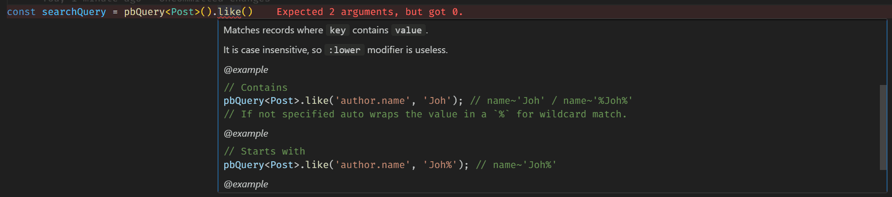

# pb-query 🔍✨

**Build type-safe PocketBase queries with the power of TypeScript.**  
*Stop wrestling with filter strings. Start composing queries like code.*

[](https://www.npmjs.com/package/@sergio9929/pb-query)


## Features

- **🚀 Full TypeScript Integration** - Autocomplete keys and validate values against your schema.
- **🔗 Chainable API** - Build complex queries with `.and()`/`.or()` logic.
- **🛡️ Injection Protection** - Automatic parameter escaping.
- **🧩 Nested Grouping** - Create complex logic with `.group()`.
- **📅 Date & Array Support** - First-class handling of dates and array operations.
- **🔍 Advanced Search** - Multi-field search with a single method call.

## Installation

```bash
# npm
npm install @sergio9929/pb-query

# pnpm
pnpm add @sergio9929/pb-query

# yarn
yarn add @sergio9929/pb-query
```

## Quick Start

### App

```ts
// test.ts

import { pbQuery } from '@sergio9929/pb-query';
import PocketBase from 'pocketbase';
import type { Post } from './types';

// PocketBase instance
const pb = new PocketBase("https://example.com");

// Build a type-safe query for posts
const query = pbQuery<Post>()
  .search(['title', 'content', 'tags', 'author'], 'footba')
  .and()
  .between('created', new Date('2023-01-01'), new Date('2023-12-31'))
  .or()
  .group(q => 
    q.anyLike('tags', 'sports')
      .and()
      .greaterThan('priority', 5)
  )
  .build(pb.filter);

console.log(query);
// (title~'footba' || content~'footba' || tags~'footba' || author~'footba') 
// && (created>='2023-01-01' && created<='2023-12-31') 
// || (tags?~'sports' && priority>5)

// Use your query
const records = await pb.collection("posts").getList(1, 20, {
  filter: query,
});
```

> [!IMPORTANT]
> You can use this package without TypeScript, but you would miss out on many of its advantages.

### PocketBase Hooks

[Learn more](https://pocketbase.io/docs/js-overview/)

```js
// pb_hooks/test.pb.js

/// <reference path="../pb_data/types.d.ts" />

routerAdd("GET", "/test", (e) => {
  const { pbQuery } = require('@sergio9929/pb-query')

  const { raw, values } = pbQuery()
    .search(['title', 'content', 'tags.title', 'author'], 'footba')
    .and()
    .between('created', new Date('2023-01-01'), new Date('2024-12-31'))
    .or()
    .group(q => 
      q.anyLike('tags', 'sports')
        .and()
        .greaterThan('priority', 5)
    )
    .build();

  try {
    const records = $app.findRecordsByFilter(
      "posts",
      raw,
      '',
      20,
      0,
      values
    )

    return e.json(200, records)
  } catch (error) {
    console.error(error)

    return e.json(404, { "message": "Not Found" })
  }

  return e.json(500, { "message": "Internal Server Error" })
})
```

## Table of Contents

- [Why pb-query?](#why-pb-query)
- [Core Concepts](#core-concepts)
- [Basic Operators](#basic-operators)
- [Combination Operators](#combination-operators)
- [Multiple Operators](#multiple-operators)
- [Helper Operators](#helper-operators)
- [Real-World Recipes](#real-world-recipes)
- [Troubleshooting](#troubleshooting)

## Why pb-query?

Building complex filters in PocketBase often leads to:

1. **String Concatenation Hell**  
    `'created >= "2023-01-01" && (tags ~ "%urgent%" || priority > 5)'`  
    😱 Prone to syntax errors and difficult to maintain.

2. **Type Safety Issues**  
    `'user.age > "twenty"'`  
    😬 Incorrect value types can cause runtime errors.

3. **Typos**  
    `'user.ege > "twenty"'`  
    😬 No type checking for field names, leading to hard-to-find bugs.

4. **Security Risks**  
    `title ~ '${userInput}'`  
    😨 Manual string interpolation can lead to injection attacks.

**pb-query solves all this:**  
```ts
pbQuery<Post>()
  .greaterThan('user.age', 25) // Type-checked age
  .and()
  .like('title', `${safeUserInput}`) // Automatic escaping
  .build(pb.filter);
```

### Code Suggestions and JSDoc

Documentation directly in your IDE.



Leveraging the power of TypeScript, we provide suggestions based on your schema.


## Core Concepts

### Building the Query

The query is finalized using `.build()`.

```ts
// ❌ Wrong
const query = pbQuery<Post>()
  .like('content', 'Top Secret%');

console.log(query);  // object with functions
```

```ts
// ✅ Right
const query = pbQuery<Post>()
  .like('content', 'Top Secret%')
  .build();

console.log(query);  // { raw: 'content~{:content1}', values: { content1: 'Top Secret%' } }
```

You can use this principle to create dynamic queries:

```ts
const dynamicQuery = pbQuery<Post>()
  .like('content', 'Top Secret%');

if (user) {
  dynamicQuery.and().equal('author', user.id);
}

const query = dynamicQuery.build();
```

Or declare global query builders for a specific schemas:

```ts
// queries.ts
export const queryUsers = pbQuery<User>();
export const queryPosts = pbQuery<Post>();
```

```ts
// pages/posts.ts
import PocketBase from 'pocketbase';

// PocketBase instance
const pb = new PocketBase("https://example.com");

const query = queryPosts
  .search('content', 'Top Secret%')
  .build(pb.filter); // use PocketBase's filter function

const records = await pb.collection("posts").getList(1, 20, {
  filter: query,
});
```

### Parameter Safety

By default, we don't filter your query. Using `.build()` returns the unfiltered query and values separately.

```ts
// ❌ Unfiltered query
const { raw, values } = pbQuery<Post>()
  .search(['title', 'content', 'tags', 'author.name', 'author.surname'], 'Football')
  .build();

console.log(raw);    // "content~{:content1}"
console.log(values); // { content1: "Top Secret%" }
```

We expose a filter function, but we recommend using the native `pb.filter()` function instead.

```ts
import PocketBase from 'pocketbase';

// PocketBase instance
const pb = new PocketBase("https://example.com");

// ✅ Filtered query
const query = pbQuery<Post>()
  .like('content', 'Top Secret%')
  .build(pb.filter); // use PocketBase's filter function

console.log(query);  // "content~'Top Secret%'"
```

### Key Modifiers

Native PocketBase query modifiers.

```ts
pbQuery<Post>()
  .equal('title:lower', 'hello world') // Case-insensitive (not needed for .like() operators)
  .equal('tags:length', 5) // If array length equals 5
  .equal('tags:each', 'Tech'); // If every array element equals 'Tech'
```

## Basic Operators

### Equality Checks

#### `.equal(key, value)`

Matches records where `key` equals `value`.

```ts
pbQuery<Post>().equal('author.name', 'Alice'); // name='Alice'
// This is case-sensitive. Use the `:lower` modifier for case-insensitive matching.
pbQuery<Post>().equal('author.name:lower', 'alice'); // name:lower='alice'
```

#### `.notEqual(key, value)`

Matches records where `key` is not equal to `value`.

```ts
pbQuery<Post>().notEqual('author.name', 'Alice'); // name!='Alice'
// This is case-sensitive. Use the `:lower` modifier for case-insensitive matching.
pbQuery<Post>().notEqual('author.name:lower', 'alice'); // name:lower!='alice'
```

### Comparisons

#### `.greaterThan(key, value)`

Matches records where `key` is greater than `value`.

```ts
pbQuery<User>().greaterThan('age', 21); // age>21
```

#### `.greaterThanOrEqual(key, value)`

Matches records where `key` is greater than or equal to `value`.

```ts
pbQuery<User>().greaterThanOrEqual('age', 18); // age>=18
```

#### `.lessThan(key, value)`

Matches records where `key` is less than `value`.

```ts
pbQuery<User>().lessThan('age', 50); // age<50
```

#### `.lessThanOrEqual(key, value)`

Matches records where `key` is less than or equal to `value`.

```ts
pbQuery<User>().lessThanOrEqual('age', 65); // age<=65
```

### Text Search

#### `.like(key, value)`

Matches records where `key` contains `value`.

It is case-insensitive, so the `:lower` modifier is unnecessary.

```ts
// Contains
pbQuery<Post>().like('author.name', 'Joh'); // name~'Joh' / name~'%Joh%'
// If not specified, auto-wraps the value in `%` for wildcard matching.
```

```ts
// Starts with
pbQuery<Post>().like('author.name', 'Joh%'); // name~'Joh%'
```

```ts
// Ends with
pbQuery<Post>().like('author.name', '%Doe'); // name~'%Doe'
```

#### `.notLike(key, value)`

Matches records where `key` doesn't contain `value`.

It is case-insensitive, so the `:lower` modifier is unnecessary.

```ts
// Doesn't contain
pbQuery<Post>().notLike('author.name', 'Joh'); // name!~'Joh' / name!~'%Joh%'
// If not specified, auto-wraps the value in `%` for wildcard matching.
```

```ts
// Doesn't start with
pbQuery<Post>().notLike('author.name', 'Joh%'); // name!~'Joh%'
```

```ts
// Doesn't end with
pbQuery<Post>().notLike('author.name', '%Doe'); // name!~'%Doe'
```

## Combination Operators

### Logical Operators

#### `.and()`

Combines the previous and the next conditions with an `and` logical operator.

```ts
pbQuery<User>().equal('name', 'Alice').and().equal('role', 'admin'); // name='Alice' && role='admin'
```

#### `.or()`

Combines the previous and the next conditions with an `or` logical operator.

```ts
pbQuery<User>().equal('name', 'Alice').or().equal('name', 'Bob'); // name='Alice' || name='Bob'
```

### Grouping

#### `.group(callback)`

Creates a logical group.

```ts
pbQuery<Post>().group(q => q.equal('status', 'active').or().equal('status', 'inactive')); // (status~'active' || status~'inactive')
```

## Multiple Operators

### Any Queries (Any/At least one of)

Useful for queries involving [back-relations](https://pocketbase.io/docs/working-with-relations/#back-relations), [multiple relation](https://pocketbase.io/docs/collections/#relationfield), [multiple select](https://pocketbase.io/docs/collections/#selectfield), or [multiple file](https://pocketbase.io/docs/collections/#filefield).

Return all authors who have published at least one book about "Harry Potter":

```ts
pbQuery<Book>().anyLike('books_via_author.title', 'Harry Potter'); // post_via_author.name?~'Harry Potter'
```

Return all authors who have only published books about "Harry Potter":

```ts
pbQuery<Book>().like('books_via_author.title', 'Harry Potter'); // post_via_author.name~'Harry Potter'
```

> [!NOTE]
> Back-relations by default are resolved as multiple relation field (see the note with the caveats), meaning that similar to all other multi-valued fields (multiple `relation`, `select`, `file`) by default a "match-all" constraint is applied and if you want "any/at-least-one" type of condition then you'll have to prefix the operator with `?`.
>
> @ganigeorgiev in [#6080](https://github.com/pocketbase/pocketbase/discussions/6080#discussioncomment-11526411)

#### `.anyEqual(key, value)`

Matches records where at least one of the values in the given `key` equals `value`.

```ts
pbQuery<Book>().anyEqual('books_via_author.title', 'The Island'); // post_via_author.name?='The Island'

// This is case-sensitive. Use the `:lower` modifier for case-insensitive matching.
pbQuery<Book>().anyEqual('books_via_author.title:lower', 'the island'); // post_via_author.name:lower?='the island'
```

#### `.anyNotEqual(key, value)`

Matches records where at least one of the values in the given `key` is not equal to `value`.

```ts
pbQuery<Book>().anyNotEqual('books_via_author.title', 'The Island'); // post_via_author.name?!='The Island'

// This is case-sensitive. Use the `:lower` modifier for case-insensitive matching.
pbQuery<Book>().anyNotEqual('books_via_author.title:lower', 'the island'); // post_via_author.name:lower?!='the island'
```

#### `.anyGreaterThan(key, value)`

Matches records where at least one of the values in the given `key` is greater than `value`.

```ts
pbQuery<User>().anyGreaterThan('age', 21); // age?>21
```

#### `.anyGreaterThanOrEqual(key, value)`

Matches records where at least one of the values in the given `key` is greater than or equal to `value`.

```ts
pbQuery<User>().anyGreaterThanOrEqual('age', 18); // age?>=18
```

#### `.anyLessThan(key, value)`

Matches records where at least one of the values in the given `key` is less than `value`.

```ts
pbQuery<User>().anyLessThan('age', 50); // age?<50
```

#### `.anyLessThanOrEqual(key, value)`

Matches records where at least one of the values in the given `key` is less than or equal to `value`.

```ts
pbQuery<User>().anyLessThanOrEqual('age', 65); // age?<=65
```

#### `.anyLike(key, value)`

Matches records where at least one of the values in the given `key` contains `value`.

It is case-insensitive, so the `:lower` modifier is unnecessary.

```ts
// Contains
pbQuery<Post>().anyLike('author.name', 'Joh'); // name?~'Joh' / name?~'%Joh%'
// If not specified, auto-wraps the value in `%` for wildcard matching.
```

```ts
// Starts with
pbQuery<Post>().anyLike('author.name', 'Joh%'); // name?~'Joh%'
```

```ts
// Ends with
pbQuery<Post>().anyLike('author.name', '%Doe'); // name?~'%Doe'
```

#### `.anyNotLike(key, value)`

Matches records where at least one of the values in the given `key` doesn't contain `value`.

It is case-insensitive, so the `:lower` modifier is unnecessary.

```ts
// Doesn't contain
pbQuery<Post>().anyNotLike('author.name', 'Joh'); // name?!~'Joh' / name?!~'%Joh%'
// If not specified, auto-wraps the value in `%` for wildcard matching.
```

```ts
// Doesn't start with
pbQuery<Post>().anyNotLike('author.name', 'Joh%'); // name?!~'Joh%'
```

```ts
// Doesn't end with
pbQuery<Post>().anyNotLike('author.name', '%Doe'); // name?!~'%Doe'
```

## Helper Operators

### Multi-Field Search

#### `.search(keys, value)`

Matches records where any of the `keys` contain `value`.

It can be used to perform a full-text search (FTS).

It is case-insensitive, so the `:lower` modifier is unnecessary.

```ts
// Full-text search
pbQuery<Post>().search(['title', 'content', 'tags', 'author.name', 'author.surname'], 'Football'); // (title~'Football' || content~'Football' || tags~'Football' || author.name~'Football' || author.surname~'Football')
```

```ts
// Contains
pbQuery<User>().search(['name', 'surname'], 'Joh'); // (name~'Joh' || surname~'Joh') / (name~'%Joh%' || surname~'%Joh%')
// If not specified, auto-wraps the value in `%` for wildcard matching.
```

```ts
// Starts with
pbQuery<User>().search(['name', 'surname'], 'Joh%'); // (name~'Joh%' || surname~'Joh%')
```

```ts
// Ends with
pbQuery<User>().search(['name', 'surname'], '%Doe'); // (name~'%Doe' || surname~'%Doe')
```

#### `.in(key, values)`

Matches records where `key` is in `values`.

```ts
pbQuery<Post>().in('id', ['id_1', 'id_2', 'id_3']); // (id='id_1' || id='id_2' || id='id_3')
```

#### `.notIn(key, values)`

Matches records where `key` is not in `values`.

```ts
pbQuery<User>().notIn('age', [18, 21, 30]); // (age!=18 && age!=21 && age!=30)
```

### Ranges

#### `.between(key, from, to)`

Matches records where `key` is between `from` and `to`.

```ts
pbQuery<User>().between('age', 18, 30); // (age>=18 && age<=30)
pbQuery<User>().between('created', new Date('2021-01-01'), new Date('2021-12-31')); // (created>='2021-01-01' && created<='2021-12-31')
```

#### `.notBetween(key, from, to)`

Matches records where `key` is not between `from` and `to`.

```ts
pbQuery<User>().notBetween('age', 18, 30); // (age<18 || age>30)
pbQuery<User>().notBetween('created', new Date('2021-01-01'), new Date('2021-12-31')); // (created<'2021-01-01' || created>'2021-12-31')
```

### Null Checks

#### `.isNull(key)`

Matches records where `key` is null.

```ts
pbQuery<User>().isNull('name'); // name=''
```

#### `.isNotNull(key)`

Matches records where `key` is not null.

```ts
pbQuery<User>().isNotNull('name'); // name!=''
```

## Real-World Recipes

### Paginated Admin Dashboard

```ts
const buildAdminQuery = (
  searchTerm: string,
  options: {
    minLogins: number;
    roles: string[];
    statuses: string[];
  }
) => pbQuery<User>()
  .search(['name', 'email', 'department'], searchTerm)
  .and()
  .greaterThanOrEqual('loginCount', options.minLogins)
  .and()
  .in('role', options.roles)
  .and()
  .group(q => 
    q.in('status', options.statuses)
      .or()
      .isNull('status')
  );
```

### E-Commerce Product Filter

```ts
const productQuery = pbQuery<Product>()
  .between('price', minPrice, maxPrice)
  .and()
  .anyLike('tags', `%${category}%`)
  .and()
  .notBetween('stock', 0, 5) // Exclude low stock
  .and()
  .group(q => 
    q.equal('color', selectedColor)
      .or()
      .isNotNull('customizationOptions')
  );
```

### Dynamic Query Building

```ts
function buildSearchQuery(term: string, filters: FilterOptions) {
  return pbQuery<Post>()
    .search(['title', 'content'], term)
    .group(q => {
      if (filters.urgent) {
        q.anyGreaterThan('priority', 7);
      }
      if (filters.recent) {
        q.between('created', subMonths(new Date(), 1), new Date());
      }
      return q;
    });
}
```

## Troubleshooting

### Common Issues

**Problem:** Date comparisons not working  
**Fix:** Always use Date objects:
```ts
pbQuery<Post>().between('created', new Date('2023-01-01'), new Date());
```

### Performance Tips

1. **Set Max Depth for TypeScript**  
    By default, we infer types up to 6 levels deep. You can change this for each query.

    For example, this is 3 levels deep:

    ```ts
    // author.info.age
    ```

    ```ts
    pbQuery<Post, 3>()
      .equal('author.info.age', 30)
      .and()
      .like('author.email', '%@example.com');
    // author.info.age=30 && author.email~'%@example.com'
    ```

---

**@sergio9929/pb-query** is maintained by [@sergio9929](https://github.com/sergio9929) with ❤️
Found a bug? [Open an issue](https://github.com/sergio9929/pb-query/issues)
Want to contribute? [Read our guide](CONTRIBUTING.md)
