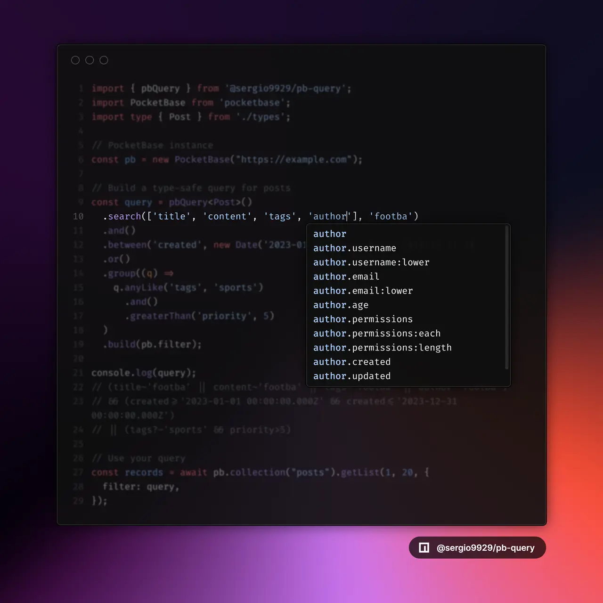

# pb-query 🔍✨

**Build type-safe PocketBase queries using TypeScript.**
*Flexible and strongly-typed, with useful helpers to simplify the querying process.*

[](https://www.npmjs.com/package/@sergio9929/pb-query)

[](https://sergio9929.github.io/pb-query/)
[](https://deepwiki.com/sergio9929/pb-query)

## Documentation

Go to documentation: https://sergio9929.github.io/pb-query/

## Features

- **💬 Full TypeScript Integration**: Get autocompletion for fields and type safety based on your schema.
- **📖 Built-in Documentation**: Get examples and explanations directly in your IDE with JSDoc.
- **🔗 Chainable API**: Easily build complex queries using a functional, intuitive syntax.
- **🛡️ Injection Protection**: Automatically sanitize queries with `pb.filter()`.
- **🧩 Nested Grouping**: Create advanced logic with `.group()`.
- **📅 Date & Array Support**: Seamlessly work with dates and array operations.
- **🔍 Advanced Search**: Perform multi-field searches with a single method call.
- **⚡ Helper Operators**: Use built-in helpers like `.search()`, `.between()`, `.in()`, `.isNull()`, and more.
- **🪝 Works Everywhere**: Use queries both in your app and inside `pb_hooks`.

## Installation

```bash
# npm
npm install @sergio9929/pb-query

# pnpm
pnpm add @sergio9929/pb-query

# yarn
yarn add @sergio9929/pb-query
```

## Quick Start

### App

```ts
// example.ts

import { pbQuery } from '@sergio9929/pb-query';
import PocketBase from 'pocketbase';
import type { Post } from './types';

// PocketBase instance
const pb = new PocketBase("https://example.com");

// Build a type-safe query for posts
const query = pbQuery<Post>()
  .fields([
    'title',
    'content:excerpt(100,true)',
    'author',
    'expand.author.name', // Automatically expanded
    'expand.comments_via_post', // Automatically expanded
  ]) // Optional
  .search(['title', 'content', 'tags', 'author'], 'footba')
  .and()
  .between('created', new Date('2023-01-01'), new Date('2023-12-31'))
  .or()
  .group((q) =>
    q.anyLike('tags', 'sports')
      .and()
      .greaterThan('priority', 5)
  )
  .sort(['title', '-created'])
  .build(pb.filter);

console.log(query.expand);
// Output: 'author,comments_via_post'

console.log(query.fields);
// Output: 'title,content:excerpt(100,true),author,expand.author,expand.comments_via_post'

console.log(query.filter);
// Output: "(title~'footba' || content~'footba' || tags~'footba' || author~'footba')
// && (created>='2023-01-01 00:00:00.000Z' && created<='2023-12-31 00:00:00.000Z')
// || (tags?~'sports' && priority>5)"

console.log(query.sort);
// Output: 'title,-created'

// Use your query
const records = await pb.collection("posts").getList(1, 20, query);
```

> [!IMPORTANT]
> You can use this package without TypeScript, but you would miss out on many of its advantages.

### PocketBase Hooks

[Learn more](https://pocketbase.io/docs/js-overview/)

```js
// pb_hooks/example.pb.js

/// <reference path="../pb_data/types.d.ts" />

routerAdd("GET", "/example", (e) => {
  const { pbQuery } = require('@sergio9929/pb-query');

  const { filter, sort } = pbQuery()
    .search(['title', 'content', 'tags.title', 'author'], 'footba')
    .and()
    .between('created', new Date('2023-01-01'), new Date('2024-12-31'))
    .or()
    .group((q) =>
      q.anyLike('tags', 'sports')
        .and()
        .greaterThan('priority', 5)
    )
    .sort(['title', '-created'])
    .build();

  const records = $app.findRecordsByFilter(
    'posts',
    filter.raw,
    sort,
    20,
    0,
    filter.values,
  );

  return e.json(200, records);
});
```

## Table of Contents

- ✨ [Why pb-query?](#why-pb-query)
- 🧠 [Core Concepts](#core-concepts)
- 🔧 [Basic Operators](#basic-operators)
- 🧩 [Combination Operators](#combination-operators)
- 🛠️ [Multiple Operators](#multiple-operators)
- ⚡ [Helper Operators](#helper-operators)
- 🔍 [Fields and Expand](#fields-and-expand)
- ⬇️ [Sorting](#sorting)
- 💡 [Tips and Tricks](#tips-and-tricks)
- 🚨 [Troubleshooting](#troubleshooting)
- 🙏 [Credits](#credits)

## Why pb-query?

Our goal was to build a flexible, strongly-typed query builder with useful helpers to simplify the querying process. But more importantly, we wanted to create a tool that helps prevent errors and provides examples and solid autocompletion in the IDE. This way, when we come back to the project after a long time, we won't need to relearn the intricacies of PocketBase's querying syntax.

### Code Suggestions and JSDoc

Documentation directly in your IDE.


Leveraging the power of TypeScript, we provide suggestions based on your schema.



## Credits

This project was inspired by [@emresandikci/pocketbase-query](https://github.com/emresandikci/pocketbase-query).

---

**@sergio9929/pb-query** is maintained by [@sergio9929](https://github.com/sergio9929) with ❤️

Found a bug? [Open an issue](https://github.com/sergio9929/pb-query/issues)
