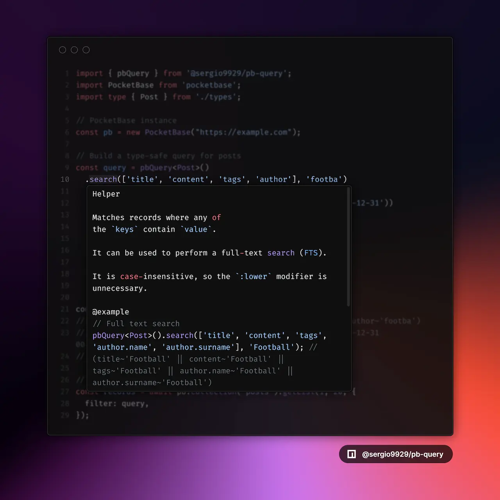

# pb-query 🔍✨

**Build type-safe PocketBase queries with the power of TypeScript.**
*Flexible and strongly-typed, with useful helpers to simplify the querying process.*

[](https://www.npmjs.com/package/@sergio9929/pb-query)

[](https://deepwiki.com/sergio9929/pb-query)

## Features

- **💬 Full TypeScript Integration** – Get autocompletion for fields and type safety based on your schema.
- **🔗 Chainable API** – Easily build complex queries using a functional, intuitive syntax.
- **🛡️ Injection Protection** – Automatically sanitize queries with `pb.filter()`.
- **🧩 Nested Grouping** – Create advanced logic with `.group()`.
- **📅 Date & Array Support** – Seamlessly work with dates and array operations.
- **🔍 Advanced Search** – Perform multi-field searches with a single method call.
- **⚡ Helper Operators** – Use built-in helpers like `.search()`, `.between()`, `.in()`, `.isNull()`, and more.
- **🪝 Works Everywhere** – Use queries both in your app and inside `pb_hooks`.
- **📖 Built-in Documentation** – Get examples and explanations directly in your IDE with JSDoc.

## Installation

```bash
# npm
npm install @sergio9929/pb-query

# pnpm
pnpm add @sergio9929/pb-query

# yarn
yarn add @sergio9929/pb-query
```

## Version Compatibility

You are reading the documentation for versions equal or higher to `pb-query@0.3.0`.

| PocketBase | pb-query | documentation |
| - | - | - |
| >= 0.22.0 | >= 0.3.0 | current |
| >= 0.22.0 | <= 0.2.9 | [read](https://github.com/sergio9929/pb-query/tree/a62a71887a7cb8f6328f35ee6b57480bdf8bfc5f) |

## Quick Start

### App

```ts
// example.ts

import { pbQuery } from '@sergio9929/pb-query';
import PocketBase from 'pocketbase';
import type { Post } from './types';

// PocketBase instance
const pb = new PocketBase("https://example.com");

// Build a type-safe query for posts
const query = pbQuery<Post>()
  .fields([
    'title',
    'content:excerpt(100,true)',
    'author',
    'expand.author.name', // Automatically expanded
    'expand.comments_via_post', // Automatically expanded
  ]) // Optional
  .search(['title', 'content', 'tags', 'author'], 'footba')
  .and()
  .between('created', new Date('2023-01-01'), new Date('2023-12-31'))
  .or()
  .group((q) =>
    q.anyLike('tags', 'sports')
      .and()
      .greaterThan('priority', 5)
  )
  .sort(['title', '-created'])
  .build(pb.filter);

console.log(query.expand);
// Output: 'author,comments_via_post'

console.log(query.fields);
// Output: 'title,content:excerpt(100,true),author,expand.author,expand.comments_via_post'

console.log(query.filter);
// Output: "(title~'footba' || content~'footba' || tags~'footba' || author~'footba')
// && (created>='2023-01-01 00:00:00.000Z' && created<='2023-12-31 00:00:00.000Z')
// || (tags?~'sports' && priority>5)"

console.log(query.sort);
// Output: 'title,-created'

// Use your query
const records = await pb.collection("posts").getList(1, 20, query);
```

> [!IMPORTANT]
> You can use this package without TypeScript, but you would miss out on many of its advantages.

### PocketBase Hooks

[Learn more](https://pocketbase.io/docs/js-overview/)

```js
// pb_hooks/example.pb.js

/// <reference path="../pb_data/types.d.ts" />

routerAdd("GET", "/example", (e) => {
  const { pbQuery } = require('@sergio9929/pb-query');

  const { filter, sort } = pbQuery()
    .search(['title', 'content', 'tags.title', 'author'], 'footba')
    .and()
    .between('created', new Date('2023-01-01'), new Date('2024-12-31'))
    .or()
    .group((q) =>
      q.anyLike('tags', 'sports')
        .and()
        .greaterThan('priority', 5)
    )
    .sort(['title', '-created'])
    .build();

  const records = $app.findRecordsByFilter(
    'posts',
    filter.raw,
    sort,
    20,
    0,
    filter.values,
  );

  return e.json(200, records);
});
```

## Table of Contents

- ✨ [Why pb-query?](#why-pb-query)
- 🧠 [Core Concepts](#core-concepts)
- 🔧 [Basic Operators](#basic-operators)
- 🧩 [Combination Operators](#combination-operators)
- 🛠️ [Multiple Operators](#multiple-operators)
- ⚡ [Helper Operators](#helper-operators)
- 🔍 [Fields and Expand](#fields-and-expand)
- ⬇️ [Sorting](#sorting)
- 💡 [Tips and Tricks](#tips-and-tricks)
- 🚨 [Troubleshooting](#troubleshooting)
- 🙏 [Credits](#credits)

## Why pb-query?

Our goal was to build a flexible, strongly-typed query builder with useful helpers to simplify the querying process. But more importantly, we wanted to create a tool that helps prevent errors and provides examples and solid autocompletion in the IDE. This way, when we come back to the project after a long time, we won't need to relearn the intricacies of PocketBase's querying syntax.

### Code Suggestions and JSDoc

Documentation directly in your IDE.



Leveraging the power of TypeScript, we provide suggestions based on your schema.


## Core Concepts

### Building the Query

The query is returned (not reset) using `.build()`.

```ts
// ❌ Wrong
const query = pbQuery<Post>()
  .like('content', 'Top Secret%');

console.log(query);  // object with functions
```

```ts
// ✅ Right
const query = pbQuery<Post>()
  .like('content', 'Top Secret%')
  .build();

console.log(query);
// {
//   fields: '',
//   expand: '',
//   sort: '',
//   filter: {
//     raw: 'content~{:content1}',
//     values: { content1: 'Top Secret%' }
//   }
// }
```

You can use this principle to create dynamic queries:

```ts
const dynamicQuery = pbQuery<Post>().like('content', 'Top Secret%');

if (user) {
  dynamicQuery.and().equal('author', user.id);
}

const query = dynamicQuery.build();
```

### Parameter Safety

By default, we don't filter your query. Using `.build()` returns the unfiltered query and values separately.

```ts
// ❌ Unfiltered query
const { filter } = pbQuery<Post>()
  .like('content', 'Top Secret%')
  .build();

console.log(filter);
// {
//   raw: 'content~{:content1}',
//   values: { content1: 'Top Secret%' }
// }
```

We expose a filter function, but we recommend using the native `pb.filter()` function instead.

```ts
import PocketBase from 'pocketbase';

// PocketBase instance
const pb = new PocketBase("https://example.com");

// ✅ Filtered query
const { filter } = pbQuery<Post>()
  .like('content', 'Top Secret%')
  .build(pb.filter); // use PocketBase's filter function

console.log(filter);  // "content~'Top Secret%'"
```

### Key Modifiers

Native [PocketBase query modifiers](https://pocketbase.io/docs/api-rules-and-filters/#special-identifiers-and-modifiers) are supported:
- `:lower` – Case-insensitive matching (not needed for `.like()` operators).
- `:length` – Array length check.
- `:each` – Array each element check.

```ts
pbQuery<Post>()
  .equal('title:lower', 'hello world') // Case-insensitive (not needed for .like() operators)
  .equal('tags:length', 5) // If array length equals 5
  .equal('tags:each', 'Tech'); // If every array element equals 'Tech'
```

### Macros

Native [PocketBase datetime macros](https://pocketbase.io/docs/api-rules-and-filters/#-macros) are supported: `@now`, `@yesterday`, `@tomorrow`, `@todayStart`, `@todayEnd`, `@monthStart`, `@monthEnd`, `@yearStart`, `@yearEnd`
- `@now` – Current datetime.
- `@yesterday` – 24 hours before `@now`.
- `@tomorrow` – 24 hours after`@now`.
- `@todayStart` – Current date (00:00:00.000Z).
- `@todayEnd` – Current date (23:59:59.999Z).
- `@monthStart` – Current month (00:00:00.000Z).
- `@monthEnd` – Current month (23:59:59.999Z).
- `@yearStart` – Current year (00:00:00.000Z).
- `@yearEnd` – Current year (23:59:59.999Z).
- [more...](https://pocketbase.io/docs/api-rules-and-filters/#-macros)

```ts
pbQuery<Post>()
  .between('created', '@now', '@yesterday') // Created between now and tomorrow
```


## Basic Operators

### Equality Checks

#### `.equal(key, value)`

Matches records where `key` equals `value`.

```ts
pbQuery<Post>().equal('author.name', 'Alice'); // name='Alice'
// This is case-sensitive. Use the `:lower` modifier for case-insensitive matching.
pbQuery<Post>().equal('author.name:lower', 'alice'); // name:lower='alice'
```

#### `.notEqual(key, value)`

Matches records where `key` is not equal to `value`.

```ts
pbQuery<Post>().notEqual('author.name', 'Alice'); // name!='Alice'
// This is case-sensitive. Use the `:lower` modifier for case-insensitive matching.
pbQuery<Post>().notEqual('author.name:lower', 'alice'); // name:lower!='alice'
```

### Comparisons

#### `.greaterThan(key, value)`

Matches records where `key` is greater than `value`.

```ts
pbQuery<User>().greaterThan('age', 21); // age>21
```

#### `.greaterThanOrEqual(key, value)`

Matches records where `key` is greater than or equal to `value`.

```ts
pbQuery<User>().greaterThanOrEqual('age', 18); // age>=18
```

#### `.lessThan(key, value)`

Matches records where `key` is less than `value`.

```ts
pbQuery<User>().lessThan('age', 50); // age<50
```

#### `.lessThanOrEqual(key, value)`

Matches records where `key` is less than or equal to `value`.

```ts
pbQuery<User>().lessThanOrEqual('age', 65); // age<=65
```

### Text Search

#### `.like(key, value)`

Matches records where `key` contains `value`.

It is case-insensitive, so the `:lower` modifier is unnecessary.

```ts
// Contains
pbQuery<Post>().like('author.name', 'Joh'); // name~'Joh' / name~'%Joh%'
// If not specified, auto-wraps the value in `%` for wildcard matching.
```

```ts
// Starts with
pbQuery<Post>().like('author.name', 'Joh%'); // name~'Joh%'
```

```ts
// Ends with
pbQuery<Post>().like('author.name', '%Doe'); // name~'%Doe'
```

#### `.notLike(key, value)`

Matches records where `key` doesn't contain `value`.

It is case-insensitive, so the `:lower` modifier is unnecessary.

```ts
// Doesn't contain
pbQuery<Post>().notLike('author.name', 'Joh'); // name!~'Joh' / name!~'%Joh%'
// If not specified, auto-wraps the value in `%` for wildcard matching.
```

```ts
// Doesn't start with
pbQuery<Post>().notLike('author.name', 'Joh%'); // name!~'Joh%'
```

```ts
// Doesn't end with
pbQuery<Post>().notLike('author.name', '%Doe'); // name!~'%Doe'
```

## Combination Operators

### Logical Operators

#### `.and()`

Combines the previous and the next conditions with an `and` logical operator.

```ts
pbQuery<User>().equal('name', 'Alice').and().equal('role', 'admin'); // name='Alice' && role='admin'
```

#### `.or()`

Combines the previous and the next conditions with an `or` logical operator.

```ts
pbQuery<User>().equal('name', 'Alice').or().equal('name', 'Bob'); // name='Alice' || name='Bob'
```

### Grouping

#### `.group(callback)`

Creates a logical group.

```ts
pbQuery<Post>().group((q) => q.equal('status', 'active').or().equal('status', 'inactive')); // (status~'active' || status~'inactive')
```

## Multiple Operators

### Any Queries (Any/At least one of)

Useful for queries involving [back-relations](https://pocketbase.io/docs/working-with-relations/#back-relations), [multiple relation](https://pocketbase.io/docs/collections/#relationfield), [multiple select](https://pocketbase.io/docs/collections/#selectfield), or [multiple file](https://pocketbase.io/docs/collections/#filefield).

Return all authors who have published at least one book about "Harry Potter":

```ts
pbQuery<Book>().anyLike('books_via_author.title', 'Harry Potter'); // post_via_author.name?~'Harry Potter'
```

Return all authors who have only published books about "Harry Potter":

```ts
pbQuery<Book>().like('books_via_author.title', 'Harry Potter'); // post_via_author.name~'Harry Potter'
```

> [!NOTE]
> Back-relations by default are resolved as multiple relation field (see the note with the caveats), meaning that similar to all other multi-valued fields (multiple `relation`, `select`, `file`) by default a "match-all" constraint is applied and if you want "any/at-least-one" type of condition then you'll have to prefix the operator with `?`.
>
> @ganigeorgiev in [#6080](https://github.com/pocketbase/pocketbase/discussions/6080#discussioncomment-11526411)

#### `.anyEqual(key, value)`

Matches records where at least one of the values in the given `key` equals `value`.

```ts
pbQuery<Book>().anyEqual('books_via_author.title', 'The Island'); // post_via_author.name?='The Island'

// This is case-sensitive. Use the `:lower` modifier for case-insensitive matching.
pbQuery<Book>().anyEqual('books_via_author.title:lower', 'the island'); // post_via_author.name:lower?='the island'
```

#### `.anyNotEqual(key, value)`

Matches records where at least one of the values in the given `key` is not equal to `value`.

```ts
pbQuery<Book>().anyNotEqual('books_via_author.title', 'The Island'); // post_via_author.name?!='The Island'

// This is case-sensitive. Use the `:lower` modifier for case-insensitive matching.
pbQuery<Book>().anyNotEqual('books_via_author.title:lower', 'the island'); // post_via_author.name:lower?!='the island'
```

#### `.anyGreaterThan(key, value)`

Matches records where at least one of the values in the given `key` is greater than `value`.

```ts
pbQuery<User>().anyGreaterThan('age', 21); // age?>21
```

#### `.anyGreaterThanOrEqual(key, value)`

Matches records where at least one of the values in the given `key` is greater than or equal to `value`.

```ts
pbQuery<User>().anyGreaterThanOrEqual('age', 18); // age?>=18
```

#### `.anyLessThan(key, value)`

Matches records where at least one of the values in the given `key` is less than `value`.

```ts
pbQuery<User>().anyLessThan('age', 50); // age?<50
```

#### `.anyLessThanOrEqual(key, value)`

Matches records where at least one of the values in the given `key` is less than or equal to `value`.

```ts
pbQuery<User>().anyLessThanOrEqual('age', 65); // age?<=65
```

#### `.anyLike(key, value)`

Matches records where at least one of the values in the given `key` contains `value`.

It is case-insensitive, so the `:lower` modifier is unnecessary.

```ts
// Contains
pbQuery<Post>().anyLike('author.name', 'Joh'); // name?~'Joh' / name?~'%Joh%'
// If not specified, auto-wraps the value in `%` for wildcard matching.
```

```ts
// Starts with
pbQuery<Post>().anyLike('author.name', 'Joh%'); // name?~'Joh%'
```

```ts
// Ends with
pbQuery<Post>().anyLike('author.name', '%Doe'); // name?~'%Doe'
```

#### `.anyNotLike(key, value)`

Matches records where at least one of the values in the given `key` doesn't contain `value`.

It is case-insensitive, so the `:lower` modifier is unnecessary.

```ts
// Doesn't contain
pbQuery<Post>().anyNotLike('author.name', 'Joh'); // name?!~'Joh' / name?!~'%Joh%'
// If not specified, auto-wraps the value in `%` for wildcard matching.
```

```ts
// Doesn't start with
pbQuery<Post>().anyNotLike('author.name', 'Joh%'); // name?!~'Joh%'
```

```ts
// Doesn't end with
pbQuery<Post>().anyNotLike('author.name', '%Doe'); // name?!~'%Doe'
```

## Helper Operators

### Multi-Field Search

#### `.search(keys, value)`

Matches records where any of the `keys` contain `value`.

It can be used to perform a full-text search (FTS).

It is case-insensitive, so the `:lower` modifier is unnecessary.

```ts
// Full-text search
pbQuery<Post>().search(['title', 'content', 'tags', 'author.name', 'author.surname'], 'Football'); // (title~'Football' || content~'Football' || tags~'Football' || author.name~'Football' || author.surname~'Football')
```

```ts
// Contains
pbQuery<User>().search(['name', 'surname'], 'Joh'); // (name~'Joh' || surname~'Joh') / (name~'%Joh%' || surname~'%Joh%')
// If not specified, auto-wraps the value in `%` for wildcard matching.
```

```ts
// Starts with
pbQuery<User>().search(['name', 'surname'], 'Joh%'); // (name~'Joh%' || surname~'Joh%')
```

```ts
// Ends with
pbQuery<User>().search(['name', 'surname'], '%Doe'); // (name~'%Doe' || surname~'%Doe')
```

#### `.in(key, values)`

Matches records where `key` is in `values`.

```ts
pbQuery<Post>().in('id', ['id_1', 'id_2', 'id_3']); // (id='id_1' || id='id_2' || id='id_3')
```

#### `.notIn(key, values)`

Matches records where `key` is not in `values`.

```ts
pbQuery<User>().notIn('age', [18, 21, 30]); // (age!=18 && age!=21 && age!=30)
```

### Ranges

#### `.between(key, from, to)`

Matches records where `key` is between `from` and `to`.

```ts
pbQuery<User>().between('age', 18, 30); // (age>=18 && age<=30)
pbQuery<User>().between('created', new Date('2021-01-01'), new Date('2021-12-31')); // (created>='2021-01-01 00:00:00.000Z' && created<='2021-12-31 00:00:00.000Z')
```

#### `.notBetween(key, from, to)`

Matches records where `key` is not between `from` and `to`.

```ts
pbQuery<User>().notBetween('age', 18, 30); // (age<18 || age>30)
pbQuery<User>().notBetween('created', new Date('2021-01-01'), new Date('2021-12-31')); // (created<'2021-01-01 00:00:00.000Z' || created>'2021-12-31 00:00:00.000Z')
```

### Null Checks

#### `.isNull(key)`

Matches records where `key` is null.

```ts
pbQuery<User>().isNull('name'); // name=''
```

#### `.isNotNull(key)`

Matches records where `key` is not null.

```ts
pbQuery<User>().isNotNull('name'); // name!=''
```

## Fields and Expand

### Field Selection

#### `.fields(keys)`

_Since v0.3.0_

**_Starter_**, **_Once_** - This can only be used once, at the start.

Accepts a single key or an array of keys.

Selects which fields to return from PocketBase. `expand()` is not needed if `fields()` is used, we automatically include what to [expand](https://pocketbase.io/docs/working-with-relations/#expanding-relations).

Modifiers:
- `*` – Targets all keys from the specific depth level.
- `:excerpt(maxLength, withEllipsis?)` – Returns a short plain text version of the field string value.

```ts
const query = pbQuery<Post>()
  .fields([
    'title',                       // Basic field
    'content:excerpt(100,true)',   // Field with excerpt modifier
    'author',                      // Relation ID field
    'expand.author',               // Expanded relation field
    'expand.comments_via_post',    // Back-relation expansion
  ])
  .build(pb.filter);

console.log(query.fields); // Output: 'title,content:excerpt(100,true),author,expand.author,expand.comments_via_post'
console.log(query.expand); // Output: 'author,comments_via_post'

const records = await pb.collection('posts').getList(1, 20, query);

console.log(records);
// Output:
// [
//   {
//     author: 'authorId',
//     title: 'Football match this Saturday',
//     content: 'Lorem ipsum dolor sit amet.',
//     expand: {
//       author: {
//         name: 'John',
//       },
//       comments_via_post: [
//         { ... },
//       ],
//     },
//   },
// ]
```

> [!WARNING]
> With the key `expand.*` we can't automatically include what to [expand](https://pocketbase.io/docs/working-with-relations/#expanding-relations), so you must specify it manually.
> ```ts
> const query = pbQuery<Post>()
>   .fields(['title', 'expand.*'])
>   .expand(['author', 'comments_via_post'])
>   .build(pb.filter);
>
> console.log(query.fields); // Output: 'title,expand.*'
> console.log(query.expand); // Output: 'author,comments_via_post'
> ```

### Expand Related Records

#### `.expand(keys)`

_Since v0.3.0_

**_Starter_**, **_Once_** - This can only be used once, at the start.

Accepts a single key or an array of keys.

Expands information from related collections. `expand()` is not needed if `fields()` is used, we automatically include what to [expand](https://pocketbase.io/docs/working-with-relations/#expanding-relations). If used together with `fields()`, it overrides the automatic expansion.

Notes:
- Supports up to 6-levels depth nested relations expansion.
- The expanded relations will be appended to the record under the [`expand`](https://pocketbase.io/docs/working-with-relations/#expanding-relations) property (e.g. `"expand": { "relField1": { ... }, ... }`).
- Only the relations to which the request user has permissions to view will be expanded.

Read more about [expand](https://pocketbase.io/docs/working-with-relations/#expanding-relations) in the [official documentation](https://pocketbase.io/docs/working-with-relations/#expanding-relations).

```ts
const query = pbQuery<Post>()
  .expand([
    'author',
    'comments_via_post',
  ])
  .build(pb.filter);

console.log(query.fields); // Output: ''
console.log(query.expand); // Output: 'author,comments_via_post'

const records = await pb.collection('posts').getList(1, 20, query);

console.log(records);
// Output:
// [
//   {
//     expand: {
//       author: { ... },
//         comments_via_post: [
//           { ... },
//         ],
//       },
//     ...,
//   },
// ]
```

## Sorting

#### `.sort(keys)`

_Since v0.3.0_

**_Once_** - This can only be used once.

Accepts a single key or an array of keys.

Sorts the results by the specified keys.

Prefixes:
- `-` – Descending order.
- `+` – **DEFAULT**. Ascending order.

Macros:
- `@random` – Orders by [sqlite's random() function](https://sqlite.org/lang_corefunc.html#random). Useful for shuffling results.
- `@rowid` – **NOT THE SAME AS `id`**. Orders by [sqlite's internal `rowid`](https://www.sqlite.org/lang_createtable.html#rowid). [Can't](https://www.sqlite.org/rowidtable.html) be used with [View Collections](https://pocketbase.io/docs/collections/#view-collection).

```ts
const query = pbQuery<Post>()
   .sort(['title', '-created'])
   .build(pb.filter);

console.log(query.sort) // Output: 'title,-created'
```

## Tips and tricks

### Typed Query Builders

```ts
// query-builders.ts
export const queryUsers = pbQuery<User>;
export const queryPosts = pbQuery<Post>;
```

```ts
// posts.ts
const searchQuery = queryPosts()
  .search(['title', 'content', 'tags', 'author'], 'footba')
  .build(pb.filter);
```

```ts
// user.ts
const userQuery = queryUsers().equal('username', 'sergio9929').build(pb.filter);
```

### Cloning queries

You can clone queries to create new query builders with an initial state. This is useful when you want to reuse a base query but apply additional conditions independently.

```ts
// Create a base query for sports-related posts
export const querySportsPosts = () => pbQuery<Post>()
  .anyLike('tags', 'sports')
  .and(); // Initial condition: ags?~'sports' &&

const searchQuery1 = querySportsPosts()
  .search(['title', 'content', 'tags', 'author'], 'basketba')
  .build(pb.filter);
// tags?~'sports' && (title~'basketba' || content~'basketba' || tags~'basketba' || author~'basketba')

const searchQuery2 = querySportsPosts()
  .search(['title', 'content', 'tags', 'author'], 'footba')
  .build(pb.filter);
// tags?~'sports' && (title~'footba' || content~'footba' || tags~'footba' || author~'footba')
```

#### How Cloning Works

1. **Initial State**: When you clone a query, it captures the current state of the query builder, including all conditions and values.
2. **Independent Instances**: Each cloned query is independent, so modifying one does not affect the others.
3. **Reusability**: Cloning is ideal for creating reusable query templates that can be extended with additional conditions.

### Dynamic Search Query

```ts
function buildSearchQuery(term: string, user: User) {
  const dynamicQuery = pbQuery<Post>().like('content', term).and();

  if (user.created < new Date('2020-01-01')) {
    return dynamicQuery
      .lessThan('created', new Date('2020-01-01'))
      .build(pb.filter); // content~'Top Secret' && created<'2020-01-01 00:00:00.000Z'
  }

  return dynamicQuery
    .greaterThanOrEqual('created', new Date('2020-01-01'))
    .build(pb.filter); // content~'Top Secret' && created>='2020-01-01 00:00:00.000Z'
}

const searchQuery = buildSearchQuery('Top Secret', user);
```

## Troubleshooting

### Common Issues

**Problem:** Date comparisons not working
**Fix:** Always use Date objects:
```ts
pbQuery<Post>().between('created', new Date('2023-01-01'), new Date());
```

### Performance Tips

1. **Set Max Depth for TypeScript**
By default, we infer types up to 6 levels deep. You can change this for each query.

For example, this is 3 levels deep:

```ts
// author.info.age
```

```ts
pbQuery<Post, 3>()
  .equal('author.info.age', 30)
  .and()
  .like('author.email', '%@example.com');
// author.info.age=30 && author.email~'%@example.com'
```


## Credits

This project was inspired by [@emresandikci/pocketbase-query](https://github.com/emresandikci/pocketbase-query).

---

**@sergio9929/pb-query** is maintained by [@sergio9929](https://github.com/sergio9929) with ❤️

Found a bug? [Open an issue](https://github.com/sergio9929/pb-query/issues)
